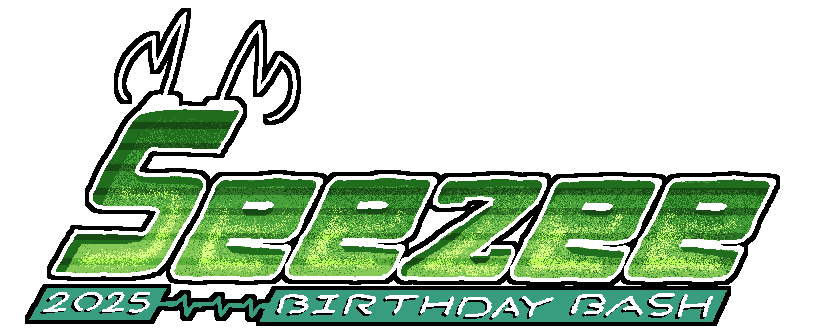
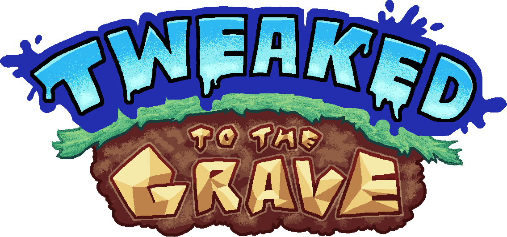

<h1>Made for the "Seezee 2025 Birthday Bash" Event</h1>

  

<h6>Hosted by: Verwex & Terionic</h6>
<h3>Happy Birthday, Seezee!</h3>
 

<h1>"Tweaked To The Grave"</h1>

  

 
  <h2>Description</h2>
  <b>Tweaked To The Grave</b> is a <b>3D Fixed Camera Shooter</b> where the goal is to chase down the boss of each level and shoot them down as you dodge infinitely generating obstales, with variety in layouts and types of obstacles in question. You play as <b>Seezee553</b>, and a creation of yours, <b>Bob Tweaked</b> has risen from the dead, looking for revenge on you for being left for years. And you must stop it on this (so far) short journey.
  <h2>Inspiration:</h2>
  The game was inspired by Starfox 64, Sonic Advance 1's bosses where you have to run constantly to get close and other things that the team can't remember, but those two are the most prevalent.
  <h2>Time of Development & Its Future:</h2>
  This game started development in late February / early March, right after <a href="https://gamejolt.com/games/yege-the-game/976332">"Yege the Game"</a> dropped, so it took a couple months to develop. But it's not the end for this game, as it will eventually be developed into a full release, with a potential kickstarter depending on how things will go in order to possibly get this on Steam. It has tons of potential after all.
  <h2>Notes & Extras:</h2>
  <h3>Notes:</h3>
  - The majority of the characters present in the game are based on real people, so keep that in mind with fan content.
   - The game contains inside jokes that while funny inside the circle may not work so well for everyone else. This will be taken care of in the full release.
   - The majority of the music in this game, in the current state it's in, is all placeholders due to time contraints.
   - If you don't do so well with reaction time, it's most likely not recommended to play the game as the pace can get rather quick.

  <h2>Credits:</h2>
  Verwex - Owner, Made 95% of all original assets, The Tweak Voice Actor
   Frakits - Additional Programming
   Terionic - Victory Theme Composer
   HeroEyad - Eydoo Voice Actor
   GlitchDotSmh - Playtester, Seezee553 Voice Actor
   Mariofy - Playtester
   Techy!Harcvuk - Playtester
   Seezee - Bob Tweaked Owner (TTTG's Inspiration)

  <h2>Additional Credits:</h2>
  Morie Jaquelin - Dialogue Font
   Phlox & Wildythomas - Bob Owners (Bob Tweaked's Inspiration)
   Tomoya Ohtani, Kenichi Tokoi, Mick Gordon, Laura Shigihara, Amellifera - Placeholder Music
   FNF Sound Team - Placeholder Main Menu Theme Ending
<h2>Reasons For Open Sourcing</h2>
For The Cutting Room Floor potential and pull requests from the community, because the codebase is not the best.

 
 
<h1>Made with Godot Engine</h1>

  

<h1>Brought to you by Team Reimagination</h1>

  

